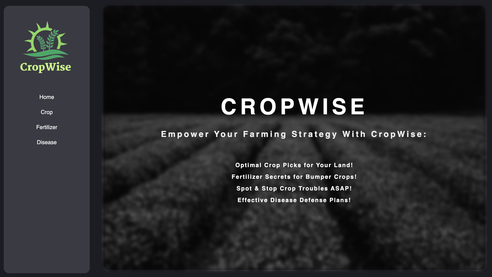
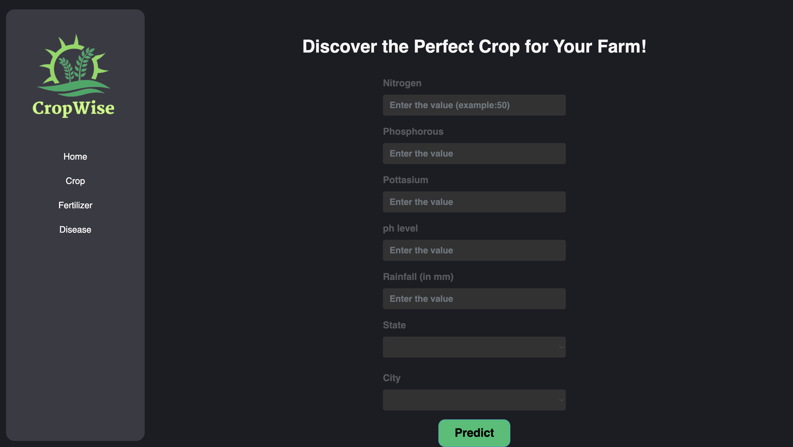
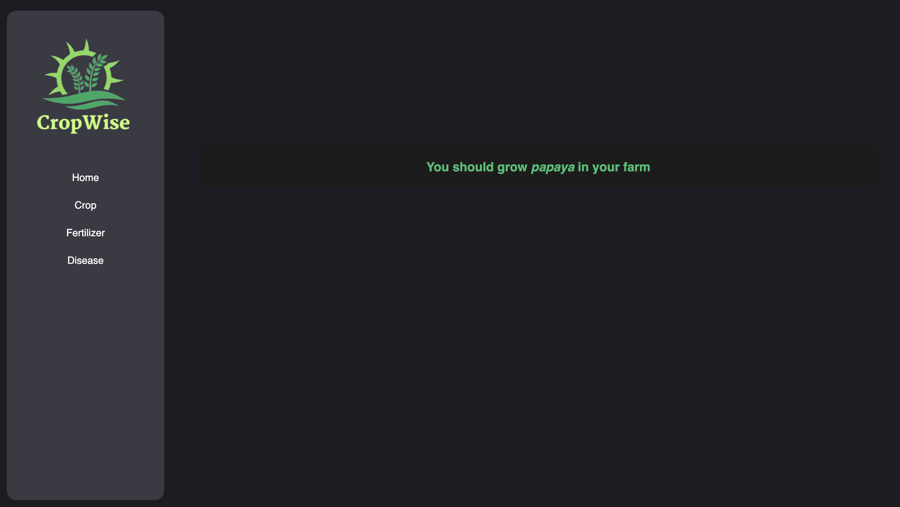
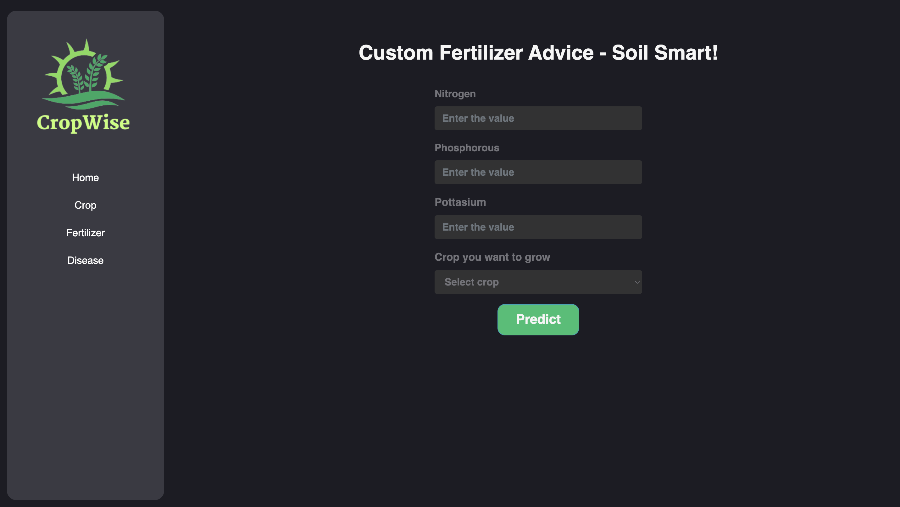
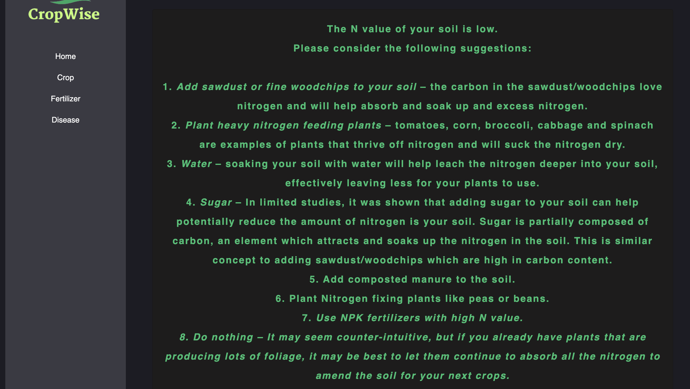
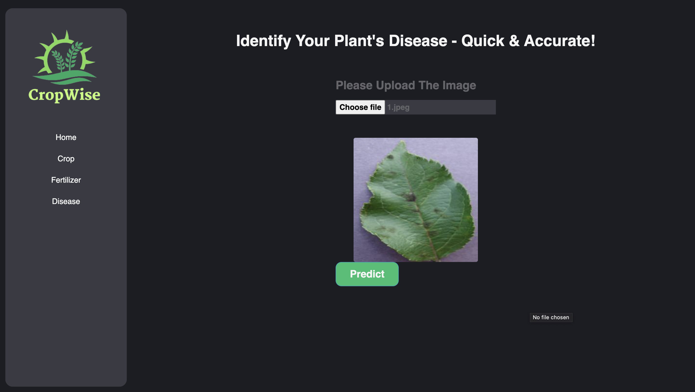
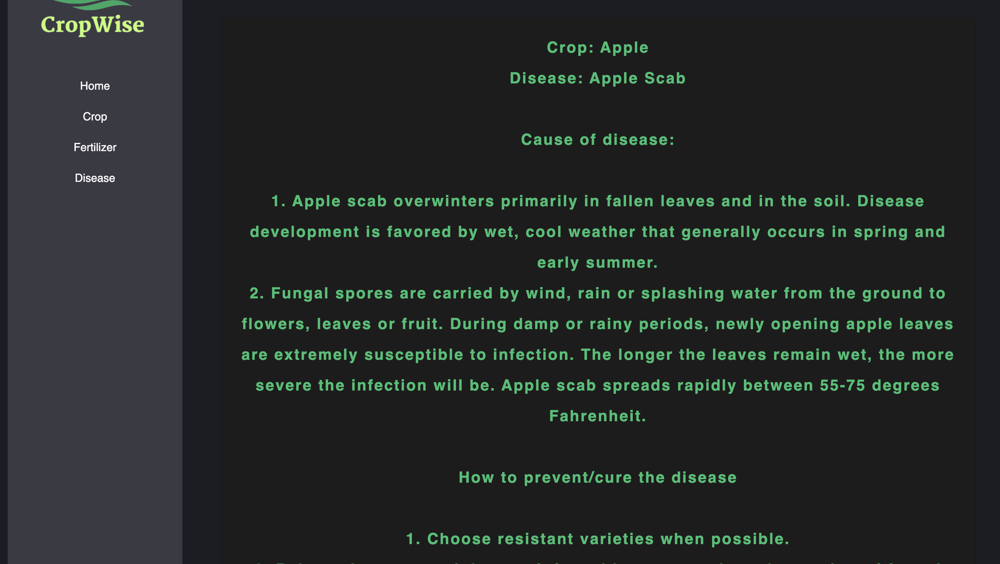

# 🌾 CropWise 📱

## Description:
CropWise is an innovative agricultural application 🚜 designed to revolutionize farming practices. This intelligent app leverages cutting-edge technologies, such as data analytics, artificial intelligence, and machine learning, to provide farmers with personalized crop recommendations for their farmland. By considering various farm-specific factors and environmental conditions, CropWise aims to optimize crop selection and enhance agricultural productivity.

## Tech Stack:
- Python
- HTML
- CSS
- JavaScript
- numpy
- pandas
- Flask
- scikit-learn

##  🌾 CropWise App: Key Features 🌾

1️⃣ **Crop Recommendation:** Intelligent suggestions for suitable crops based on farm-specific factors and historical data. 🌱📊  
2️⃣ **Disease Plant Detection:** Advanced image recognition for real-time identification and diagnosis of plant diseases. 🌿🔍 
3️⃣ **Fertilizer Recommender:** Personalized fertilizer recommendations for efficient nutrient management. 💧🌿 
4️⃣ **Easy-to-Use Interface:** User-friendly design for seamless navigation and effortless use. 🖥️👨‍🌾 

## When you enter into the project

## Crop prediction

## Result

## Fertilizer Suggestions

## Result

## Plant Disease Detection

## Result

